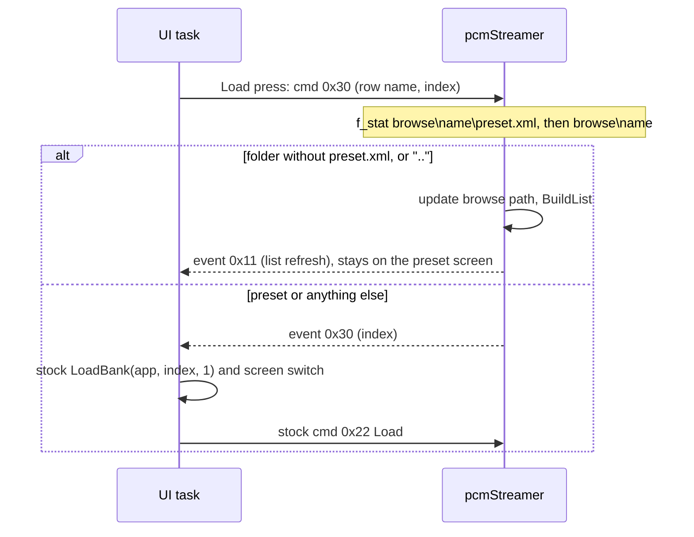

# Nested preset folders

Target: 3.1.9. The boot test is `3.1.H`. The folder image is `3.1.N` in [`firmware/patches/3.1.9-preset-folders/`](../firmware/patches/3.1.9-preset-folders/). The firmware map behind it is [map-319.md](map-319.md).

## What stock 3.1.9 does

The list is one level of `\Presets`: every immediate child directory, plus root `*.xml` legacy presets. `preset.xml` is not checked while the list is built. It is checked when a row is loaded:

- If `\Presets\<name>\preset.xml` opens, that preset loads.
- If it does not, `PresetMgr_Load` walks the rest of the list and loads the first other preset that opens. It never enters the directory.

So a grouping folder such as `\Presets\Kits\` (no `preset.xml`) can't be used. The bench reproduces this: Load on `_Test` loads `Alpha`.

## Why earlier images failed

| Image | Failure | Cause |
| --- | --- | --- |
| 3.1.F–3.1.K | Every folder hook fell back to `Presets` | `ensure()` waited for backup SRAM ready (`PWR_CR2.BRRDY`), which never came |
| 3.1.L | Card corruption | UI-task `f_write` (debug log) raced pcmStreamer. FatFs is built with `FF_FS_TINY=1` (one shared sector window) and `FF_FS_REENTRANT=0` (no lock) |
| 3.1.M | Empty preset list, boot preset not loaded | State at DTCM `0x20000000`, the first block stock's small-block allocator (`0x080443A8`) hands out. Stock objects overwrote the state, and re-initializing it zeroed a live object |

Rules that follow from the map:

- FatFs may only be called from pcmStreamer, the task that runs the PresetMgr command dispatcher.
- UI-task code may only touch RAM and post commands.
- Checking `preset.xml` for every row while building the list would cost about 40 sector reads per row (6,000 for 150 presets, against 1,161 for a stock list build). So the check runs only for the row the user loads.

## 3.1.N design

3.1.N is 3.1.M with the state moved out of DTCM.

State is 0x300 bytes in SRAM4 at `0x38000000`. Stock code never uses SRAM4, and it needs no clock enable (unlike backup SRAM). It is reset at every boot by a hook on `main`'s first call.

- `+0x100` browse path: the folder shown in the list.
- `+0x200` base path: the folder of the loaded preset.
- Both start as `Presets`.

| Site | Hook | Task | Behaviour |
| --- | --- | --- | --- |
| `0x0804418C` | `fm_boot` | boot | Reset state, then the original first call of `main` |
| `0x080A1AC0` (+ `b.n` at `0x080A1AC4`) | `hook_ui_load` | UI | Load button: post cmd 0x30 instead of `LoadBank` and the screen switch. Pads are untouched until a real load |
| `0x08092FBA` | `hook_disp` → `fm_check` | pcmStreamer | Handles cmd 0x30. The only patch code that calls FatFs, and only `f_stat` |
| `0x0809061E` | `hook_pop` | UI | Event 0x30: run the stock Load-button pair `LoadBank(app, idx, 1)` + `FUN_0809EAEC(app, 2, 0, 0)` |
| `0x080915A0` | `hook_join` | any | `preset_path_join` uses the browse path during a load or check, otherwise the base path |
| `0x080919A0`, `0x080919C2` | `hook_tryload` | pcmStreamer | Both `TryLoad` calls in `PresetMgr_Load`. On success, base = browse |
| `0x08091BF6` | `hook_xml` | pcmStreamer | Root `*.xml` scan only at the top level |
| `0x08091C46` | `hook_scan` | pcmStreamer | Directory scan of the browse path instead of `Presets` |
| `0x08091CDA` | `hook_dotdot` | pcmStreamer | Add `..` below the top level |

Event 0x30 is outside `App_Update`'s event table (id − 3 > 0x27), so stock code ignores it. Command 0x30 is outside the dispatcher table (id − 4 > 0x20).

Boot restore (`settings_load`, flag 0) and MIDI program change (flag 1 from `App_Update`) call `LoadBank` directly and keep stock behaviour.

## Bench results

`tools/bench/run_tests.py` runs the real firmware functions in Unicorn against a FAT32 image. The card is write-protected, and every test checks that no write was attempted, that the image is unchanged, and that `fsck.fat -n` is clean.

- Stock 3.1.9: 16/16, including the group-row fallback bug.
- Every test first fills DTCM through the stock allocator (64 blocks of 1 KB, scribbled), as the app's init does on the device. 3.1.M fails this (7 checks). Without it, the bench missed the 3.1.M bug.
- 3.1.N: 51/51. The checks cover entering a group (rows `..`, `One`, `Sub`, `Two`; no load; stays on screen), nested load from `Presets\_Test\Sub`, sample paths using the loaded folder after browsing away, `..` stopping at `Presets`, root xml hidden in groups, a folder with `preset.xml` loading normally, and boot init.
- Also run against a mirror of the real card's `\Presets` (146 presets, 1,275 files, WAVs stubbed): boot load of the saved preset, then a 146-row list, with no writes.
- Stack: the deepest 3.1.N path (entering a group) uses 2,568 bytes of the 8 KB pcmStreamer stack. Stock Load uses 2,256.

## Code reference

| Piece | Address | Behaviour |
| --- | --- | --- |
| List builder | `0x08091BB8` | Clears three lists, scans `*.xml`, `mkdir("Presets")`, lists `\Presets` with `*.` and directories enabled, posts 0x27/0x28/0x11/0x0F |
| Path join | `0x080915A0` | `dest = "Presets" + "\" + component`. 21 callers |
| `preset.xml` | `0x08091860` | Joins `preset.xml` onto that folder. Used by open and save |
| Load | `0x08091988` | Opens `preset.xml`. On failure, tries every other row |
| Load button | `0x080A1ABC` | Case 0x18/0xD8 of the app event handler: `LoadBank(app, idx, 1)`, then the screen switch |
| `ListDirs` | `0x08042CD0` | Directory walk used only by clean/delete at `0x0809283C`. Not touched, because that path deletes |
