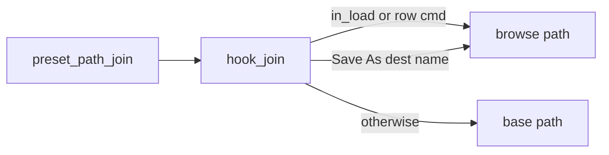

# Nested preset folders

Target: 3.1.9. The boot test is `3.1.H`. The folder image is `3.1.V` in [`firmware/patches/3.1.9-preset-folders/`](../firmware/patches/3.1.9-preset-folders/). Folders plus Clip/Slicer Warp is `3.1.X` in [`firmware/patches/3.1.9-folders-repitch/`](../firmware/patches/3.1.9-folders-repitch/). The firmware map behind it is [map-319.md](map-319.md).

## What stock 3.1.9 does

The list is one level of `\Presets`: every immediate child directory, plus root `*.xml` legacy presets. `preset.xml` is not checked while the list is built. It is checked when a row is loaded:

- If `\Presets\<name>\preset.xml` opens, that preset loads.
- If it does not, `PresetMgr_Load` walks the rest of the list and loads the first other preset that opens. It never enters the directory.

So a grouping folder such as `\Presets\Kits\` (no `preset.xml`) can't be used. The bench reproduces this: Load on `_Test` loads `Alpha`.

## Why earlier images failed

| Image | Failure | Cause |
| --- | --- | --- |
| 3.1.F–3.1.K | Every folder hook fell back to `Presets` | `ensure()` waited for backup SRAM ready (`PWR_CR2.BRRDY`), which never came |
| 3.1.L | Card corruption | UI-task `f_write` (debug log) raced pcmStreamer. FatFs is built with `FF_FS_TINY=1` (one shared sector window) and `FF_FS_REENTRANT=0` (no lock) |
| 3.1.M | Empty preset list, boot preset not loaded | State at DTCM `0x20000000`, the first block stock's small-block allocator (`0x080443A8`) hands out. Stock objects overwrote the state, and re-initializing it zeroed a live object |
| 3.1.N | Save As into a subfolder vanished; Delete/Rename/New/Clean used the wrong folder | `hook_join` used the browse path only while `in_load` was set. Row commands run with that flag clear, so they wrote or deleted in the loaded preset's folder |
| 3.1.O | Random crashes, including on the pads screen | `App_Update` rebuilds the preset list on a timer even when Presets is not open. The `/` marker called `f_stat` twice per row on every rebuild (4,227 sector reads for 146 rows) on pcmStreamer's 8 KB stack |

Rules that follow from the map:

- FatFs may only be called from pcmStreamer, the task that runs the PresetMgr command dispatcher.
- UI-task code may only touch RAM and post commands.
- Patch code never writes to the card. Card writes only come from the stock handlers; the hooks choose the folder they act on.

## 3.1.P design

State is about 10 KB in SRAM4 at `0x38000000`. Stock code never uses SRAM4, and it needs no clock enable. It is reset at every boot by a hook on `main`'s first call.

- `+0x004` `in_load`: path joins use the browse folder (load, check, and the row-command wrappers).
- `+0x00C` `save_name`: pointer to the Save As destination name. That join uses the browse folder even when `in_load` is clear, so sample copies still come from the loaded preset.
- `+0x100` browse path: the folder shown in the list.
- `+0x200` base path: the folder of the loaded preset.
- `+0x500` FILINFO + path scratch, so BuildList does not grow the pcmStreamer stack.
- `+0x720` group-name cache for the current browse path. A later timer rebuild is RAM-only.
- Both paths start as `Presets`.

| Site | Hook | Task | Behaviour |
| --- | --- | --- | --- |
| `0x0804418C` | `fm_boot` | boot | Reset state, then the original first call of `main` |
| `0x080A1AC0` (+ `b.n` at `0x080A1AC4`) | `hook_ui_load` | UI | Load button: post cmd 0x30 instead of `LoadBank` and the screen switch. Pads are untouched until a real load |
| `0x08092FBA` | `hook_disp` → `fm_check` | pcmStreamer | Handles cmd 0x30. The only patch code that calls FatFs on a Load, and only `f_stat` |
| `0x0809061E` | `hook_pop` | UI | Event 0x30: run the stock Load-button pair `LoadBank(app, idx, 1)` + `FUN_0809EAEC(app, 2, 0, 0)` |
| `0x080915A0` | `hook_join` | any | `preset_path_join` uses browse while `in_load` is set, or when the component is the Save As destination; otherwise base. A leading `/` is stripped |
| `0x08091588` | `hook_legacy` | pcmStreamer | Root `name.xml` only at the top level. Below that the path is `..`, which FatFs rejects (`FF_FS_RPATH=0`, `FR_INVALID_NAME`) |
| `0x080919A0`, `0x080919C2` | `hook_tryload` | pcmStreamer | Both `TryLoad` calls in `PresetMgr_Load`. On success, base = browse |
| `0x08091BF6` | `hook_xml` | pcmStreamer | Root `*.xml` scan only at the top level |
| `0x08091C46` | `hook_scan` | pcmStreamer | Directory scan of the browse path instead of `Presets` |
| `0x08091C6A` | `hook_mark` | pcmStreamer | Directory row: if `<browse>\<name>` has no `preset.xml`, the list name is `/name` |
| `0x08091CDA` | `hook_dotdot` | pcmStreamer | Add `..` below the top level |
| `0x08093094` | `hook_saveas` | pcmStreamer | Cmd 0x21: destination name is remembered so dest joins use browse and source joins use base |
| `0x080930AA` | `hook_saveas_als` | pcmStreamer | Cmd 0x21 Ableton export next to the new `preset.xml` |
| `0x08093124` | `hook_rename` | pcmStreamer | Cmd 0x14 in the browse folder. `..` is refused. Group folders may be renamed; the list is rebuilt so the `/` marker follows |
| `0x08093136` | `hook_new` | pcmStreamer | Cmd 0x15 in the browse folder. `..` is refused |
| `0x08093148` | `hook_delete` | pcmStreamer | Cmd 0x17 in the browse folder. `..` and group-folder rows are refused; the UI still gets event 0x27 |
| `0x0809315C` | `hook_clean` | pcmStreamer | Cmd 0x24 in the browse folder. `..` and group-folder rows are refused (stock Clean posts no event) |
| `0x080BD9F6` | `hook_back` | UI | Type-2 key 0x7F: post cmd 0x30 for `..`. At `\Presets` it leaves the screen as stock |
| `0x080BD960` | `hook_back_evt` | UI | Unhandled event type 0x7F on the preset screen (`b.w`, not `bl`) |
| `0x080A2EAA` | `hook_type7` | UI | `App_HandleInput` type 7 |
| `0x080438DE` | `hook_gpio` | scan | PC2 falling edge: post `..` if the list starts with it |

Event 0x30 is outside `App_Update`'s event table (id − 3 > 0x27), so stock code ignores it. Command 0x30 is outside the dispatcher table (id − 4 > 0x20).

Plain Save (cmd 0x20) and Pack (cmd 0x23) are not hooked: they act on the loaded preset, so the base folder is correct.

Boot restore (`settings_load`, flag 0) and MIDI program change (flag 1 from `App_Update`) call `LoadBank` directly and keep stock behaviour.

## Compatibility with stock firmware

Folders are plain FAT directories. Nothing is converted.

- Stock 3.1.9 shows group folders as rows it can't load (it falls back to another preset) and can't reach the presets inside them.
- Moving presets back to the top level of `\Presets` restores stock access.
- On stock firmware, do not use Delete on a group-folder row: it would erase the whole folder.
- Boot restore stores only the preset name, so a preset loaded from a subfolder is not restored at power-on, on either firmware.

## Bench results

`tools/bench/run_tests.py` runs the real firmware functions in Unicorn against a FAT32 image. Read-only tests write-protect the card and check that no write was attempted, that the image is unchanged, and that `fsck.fat -n` is clean. Save / Delete / Rename / New / Clean tests allow writes and check the exact set of files that changed.

- Stock 3.1.9: 16/16, including the group-row fallback bug.
- Every test first fills DTCM through the stock allocator (64 blocks of 1 KB, scribbled), as the app's init does on the device. 3.1.M fails this (7 checks). Without it, the bench missed the 3.1.M bug.
- 3.1.P: 125/125. Same behaviour checks as 3.1.O, plus a second BuildList (the App_Update timer) that keeps the `/` marks and drops to 5 sector reads on the small tree (first build 1,035).
- FatFs probe (`FF_FS_RPATH=0`): `Presets\_Test\..` and a bare `..` return `FR_INVALID_NAME` (6). `Presets\/_Test` is accepted (`/` is a separator), so the hooks still strip a leading `/`.
- List-build cost on a 146-row tree: first build is still 4,227 sector reads vs 1,049 stock (two `f_stat`s per row, once per folder). The second build is 41 reads, same as stock. `tools/bench/time_list.py` repeats the measurement.
- Stack: the deepest 3.1.N path (entering a group) used 2,568 bytes of the 8 KB pcmStreamer stack. Stock Load uses 2,256. 3.1.P keeps FILINFO and the mark path in SRAM4, so the `/` check does not add a 0x324-byte frame on top of BuildList.

## Code reference

| Piece | Address | Behaviour |
| --- | --- | --- |
| List builder | `0x08091BB8` | Clears three lists, scans `*.xml`, `mkdir("Presets")`, lists `\Presets` with `*.` and directories enabled, posts 0x27/0x28/0x11/0x0F |
| Path join | `0x080915A0` | `dest = "Presets" + "\" + component`. 21 callers |
| Legacy `name.xml` | `0x08091588` | Root `name.xml`. Used by load-migration, delete, rename, save |
| `preset.xml` | `0x08091860` | Joins `preset.xml` onto that folder. Used by open and save |
| Load | `0x08091988` | Opens `preset.xml`. On failure, tries every other row |
| Save As | `0x08091E80` | Dest joins use the new name, source joins use the old name. Dispatcher cmd 0x21 at `0x08093094` |
| Rename / New / Delete / Clean | `0x08092BB8` / `0x08092C58` / `0x08092E68` / `0x0809283C` | Dispatcher calls at `0x08093124` / `0x08093136` / `0x08093148` / `0x0809315C` |
| Load button | `0x080A1ABC` | Case 0x18/0xD8 of the app event handler: `LoadBank(app, idx, 1)`, then the screen switch |
| Preset-screen BACK | `0x080BD9DA` | Key 0x7F: `ui_post_event_up` at `0x080BD9F6`, which leaves to pads |
| `ListDirs` | `0x08042CD0` | Directory walk used only by clean/delete at `0x0809283C`. Not touched; the clean hook only chooses the folder |
